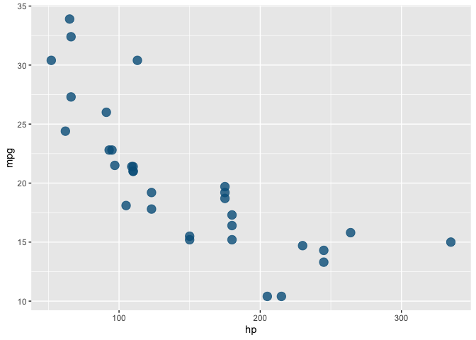
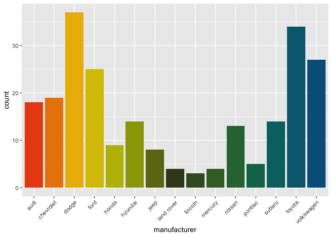

<!-- README.md is generated from README.Rmd. Please edit that file -->


# gmRi

<!-- badges: start -->

<!-- badges: end -->

The goal of gmRi is to consolidate useful reasearch tools under one
consistent repository. Things like official GMRI colors or stylesheets
for Rmarkdown documents are easy first steps in creating consistent and
professsional looking documents. Consistent workflows for creating
datasets from outside sources like from satellite SST or NERACOOS buoy
arrays will make our work take less time and be consistent in-house.

## Installation

You can install the development version of gmRi from
[GitHub](www.github.com) with:

``` r
devtools::install_github("https://github.com/gulfofmaine/gmRi")
```

This package is stored on a private repository, and in order to access
it through `devtools::install_github()` a github personal access token
needs to be available in your R system environment. To check your R
system environment run `Sys.getenv()` in the R console and look for
`GITHUB_PAT`. If there is no `GITHUB_PAT` set in your system
environment, you can generate a new token in your browser at
[github](https://github.com/settings/tokens), with more detailed
instructions at [Happy git with
R](https://happygitwithr.com/github-pat.html). Once a new token is
generated, you can add it to your R system environment by typing:
`Sys.setenv(GITHUB_PAT = "my new github access token copied from the
browser")`

Once the personal access token (PAT) is set you should be able to
install the package (assuming you have access to the gulfofmaine
github).

## Example

This is a basic example of how to pull GMRI colors for a ggplot2 figure:

``` r
library(gmRi)
library(ggplot2)
## basic example code

ggplot(mtcars, aes(hp, mpg)) +
  geom_point(color = gmri_cols("gmri blue"), size = 4, alpha = .8)
```



If you want to use a gmri color palette you can access them this way:

``` r
ggplot(mpg, aes(manufacturer, fill = manufacturer)) +
   geom_bar() +
   theme(axis.text.x = element_text(angle = 45, hjust = 1)) +
   scale_fill_gmri(palette = "mixed", guide = "none")
```


