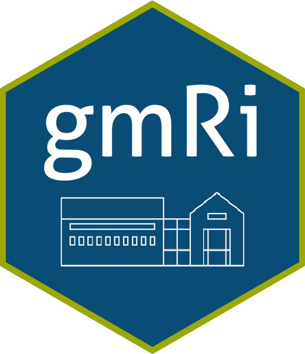

<!-- README.md is generated from README.Rmd. Please edit that file -->



# gmRi

<!-- badges: start -->
<!-- badges: end -->

The goal of {gmRi} is to consolidate useful research tools under one
consistent repository. Things like official GMRI colors or style sheets
for Rmarkdown documents are easy first steps in creating consistent and
professional looking documents. Consistent work flows for creating
datasets from outside sources like from satellite SST or NERACOOS buoy
arrays will make our work take less time and be consistent in-house.

## Installation

You can install the development version of gmRi from
[GitHub](www.github.com) with:

``` r
devtools::install_github("https://github.com/gulfofmaine/gmRi")
```

This package is stored on a private repository, and in order to access
it through `devtools::install_github()` a github personal access token
needs to be available in your R system environment. If you are getting
the following error message you either do not have access to this
private repository or you need to set your github PAT:

    Error: Failed to install ‘unknown package’ from GitHub:
      HTTP error 404.
      Not Found
      Did you spell the repo owner (`gulfofmaine`) and repo name (`gmRi`) correctly?
      - If spelling is correct, check that you have the required permissions to access the repo.

To check your R system environment for your github PAT run
`Sys.getenv()` in the R console and look for `GITHUB_PAT`. If there is
no `GITHUB_PAT` set in your system environment, you can generate a new
token in your browser at [github](https://github.com/settings/tokens),
with more detailed instructions at [Happy git with
R](https://happygitwithr.com/github-pat.html).

Once a new token is generated, you will need to add it to your R system
environment. Typing `usethis::edit_r_environ()` will open a new tab in
Rstudio called “.Renviron”. In that new file you will assign your
GITHUB\_PAT by typing:

    GITHUB_PAT=my_new_github_access_token_copied_from_the_browser

Save the .Renviron file, and restart your R session. Your Github
personal access token should now be visible when you type:
`Sys.getenv()`.

After the personal access token (PAT) is set you should be able to
install the package (assuming you have access to the gulfofmaine
github).

## Example

This is a basic example of how to pull GMRI colors for a ggplot2 figure:

``` r
library(gmRi)
library(ggplot2)
#> Warning: package 'ggplot2' was built under R version 3.6.2
## basic example code

ggplot(mtcars, aes(hp, mpg)) +
  geom_point(color = gmri_cols("gmri blue"), size = 4, alpha = .8)
```


If you want to use a gmri color palette you can access them this way:

``` r
ggplot(mpg, aes(manufacturer, fill = manufacturer)) +
   geom_bar() +
   theme(axis.text.x = element_text(angle = 45, hjust = 1)) +
   scale_fill_gmri(palette = "mixed", guide = "none")
```


# Additional Vignettes:

1.  Details on accessing style sheets and GMRI branded materials refer
    to: [vignette 1 : GMRI Style
    Doc](http://gulfofmaine.github.io/gmRi/doc/GMRI_Style_Doc.html)

2.  Accessing OISST data via thredds and performing common tasks.
    [vignette 2 : OISST
    How-To](http://gulfofmaine.github.io/gmRi/doc/oisst_howto.html)

3.  Working with pre-processed OISST resources on box from OISST
    Mainstays Repo. [OISST Mainstays - GMRI OISST Resources on
    Box](http://gulfofmaine.github.io/gmRi/doc/oisst_mainstays_workflow.html)
